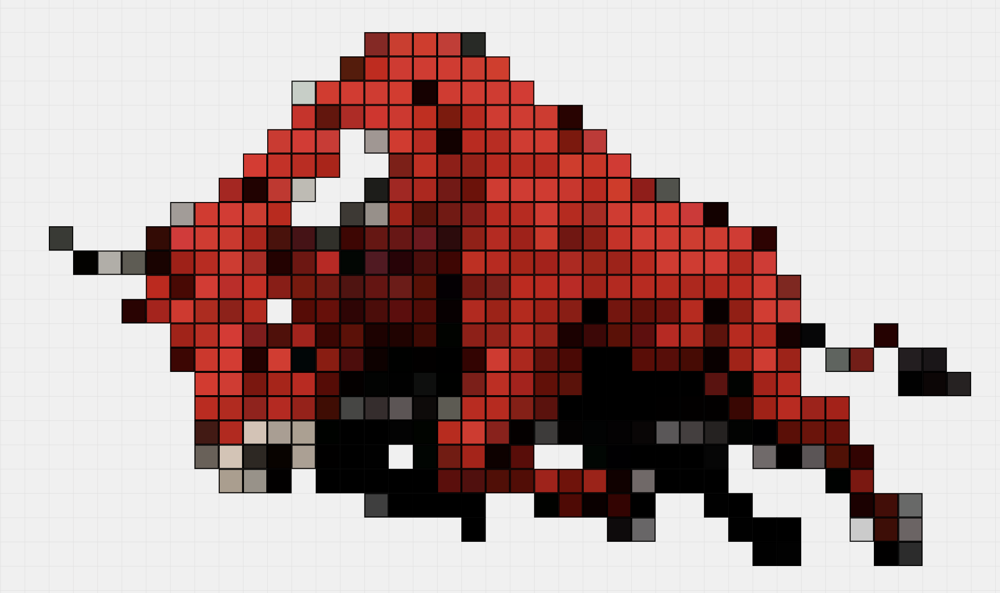

# Constructor

Constructor is an interactive web application that allows users to create, manipulate, and manage rectangles on a large canvas. This tool is designed for users who need to visualize and calculate relationships between different elements represented as rectangles. Below are the comprehensive features and functionalities of Constructor.

## Features

- **Rectangle Creation**: 
  - Right-click on the canvas to create a rectangle at the desired location.
  - Default size is adjustable, and rectangles can be created with specific dimensions.

- **Resizing and Moving**: 
  - Drag the corners of rectangles to resize them.
  - Click and drag to move rectangles around the canvas.
  - Supports multi-selection for moving multiple rectangles simultaneously.

- **Multiple Selection**: 
  - Hold the `Ctrl` key (or `Cmd` on Mac) to select multiple rectangles.
  - Selected rectangles can be manipulated together.

- **Context Menu**: 
  - Right-click on rectangles or the canvas to access a context menu with options:
    - **Connect**: Create a connection between two selected rectangles.
    - **Delete**: Remove selected rectangles from the canvas.
    - **Add Label**: Edit the label of a selected rectangle.
    - **Calculation Rectangle**: Create a special rectangle that evaluates expressions.
    - **Backup**: Save the current state of rectangles and connections.
    - **Restore**: Load previously saved rectangles and connections.
    - **Clear All**: Remove all rectangles and connections from the canvas.
    - **Export SVG**: Download the current canvas as an SVG file.

- **Calculations**: 
  - Create calculation rectangles that can evaluate expressions based on the values of connected rectangles.
  - Supports dynamic updates of calculations when connected rectangles change.

- **Save and Restore**: 
  - Automatically saves the state of rectangles and connections in local storage.
  - Users can restore their previous work upon reloading the application.

- **Drag and Drop Support**: 
  - Users can drag and drop JSON files to import rectangles and connections.
  - Supports exporting the current state to a JSON file for backup.

- **Keyboard Shortcuts**: 
  - Use `Ctrl+C` (or `Cmd+C` on Mac) to copy selected rectangles.
  - Use `Ctrl+V` (or `Cmd+V` on Mac) to paste copied rectangles.
  - Use the `Delete` key to remove selected rectangles.

- **Zoom and Pan**: 
  - Use the mouse wheel to zoom in and out of the canvas.
  - Hold the `Shift` key and drag to pan around the canvas.

## Technologies Used

- HTML
- CSS
- JavaScript

## Authors

- [Your Name](https://github.com/your-username)

## License

This project is licensed under the MIT License. See the [LICENSE](LICENSE) file for more details.
